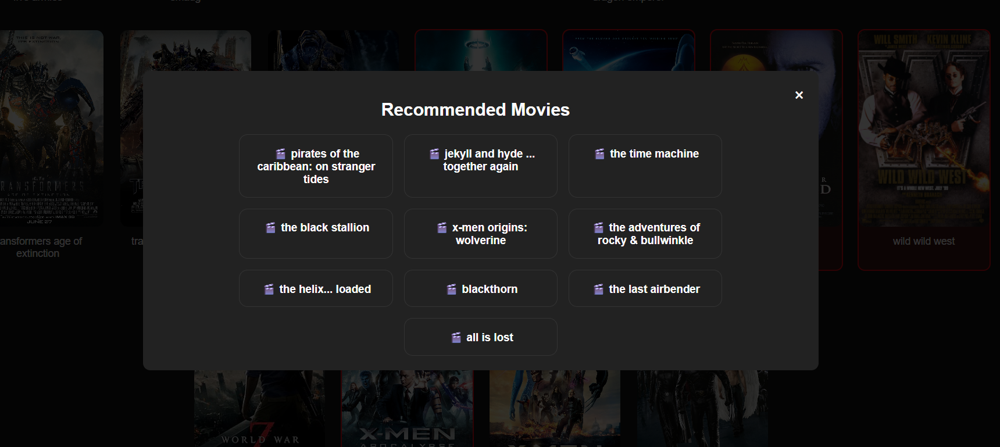

# 🎬 Movie Recommender AI

An AI-powered movie recommendation system built with **Flask**, **Python**, and **Machine Learning** that suggests similar movies based on user-selected films through an interactive Netflix-inspired web interface.

## ✨ Features

* 🎥 Browse movies with poster-based selection
* 🔍 Search movies instantly
* 🤖 AI-powered movie recommendations
* 🎨 Modern Netflix-inspired dark UI
* ➕ Add new movies and retrain recommendations
* ⚡ Fast content-based filtering using TF-IDF and Cosine Similarity

## 🛠️ Tech Stack

* Python
* Flask
* Pandas
* Scikit-learn
* HTML
* CSS
* JavaScript

## 📂 Project Structure

```text
Movie-Recommender-AI/
│
├── images/
├── templates/
├── recommender.py
├── Cleaned_Movies.csv
├── similarity.pkl
├── requirements.txt
├── Procfile
└── README.md
```

## 🚀 Installation

Clone the repository:

```bash
git clone https://github.com/Sourabhnamdev9981/movie-recommender-ai.git
cd movie-recommender-ai
```

Create a virtual environment:

```bash
python -m venv venv
```

Activate the environment:

```bash
venv\Scripts\activate
```

Install dependencies:

```bash
pip install -r requirements.txt
```

Run the application:

```bash
python recommender.py
```

Open:

```text
http://127.0.0.1:5000
```

## 🧠 How It Works

1. User selects one or more movies.
2. Movie metadata is processed using TF-IDF vectorization.
3. Cosine similarity is calculated between movies.
4. The system recommends the most similar movies.

## 📸 Screenshots

### Homepage


### Search Feature


### Recommendations



## 🔮 Future Improvements

* Movie posters for recommendations
* TMDB API integration
* User authentication
* Watchlist functionality
* Movie ratings and reviews
* Cloud deployment

